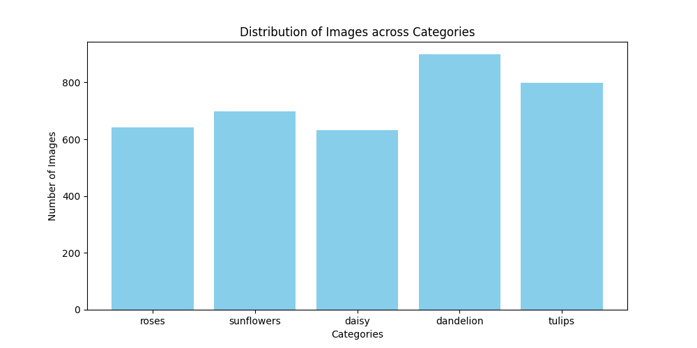
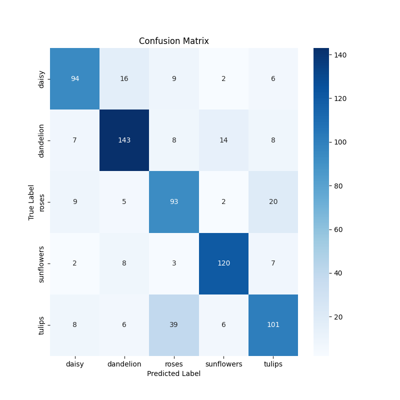
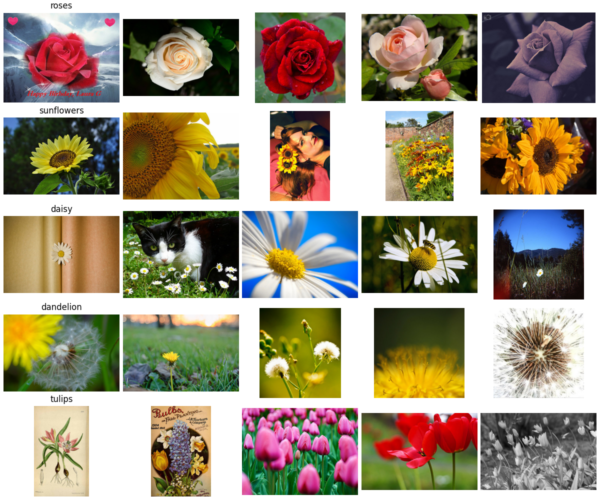

# Building an Image Classifier for Flower Recognition: A Journey with TensorFlow and Keras
*Note: Most of this post was generated by AI!*
## Introduction
In the ever-evolving field of artificial intelligence, image classification has taken a pivotal role in making sense of visual data. This project revolves around creating a model that can accurately classify images of flowers. We used TensorFlow and Keras, popular libraries in the deep learning community, to achieve this goal. This blog post outlines the steps taken from data analysis to model evaluation, the challenges we faced, and the solutions we implemented.

  

## Dataset Overview
The project utilized a publicly available flower dataset, which was structured into three main categories: training, validation, and test sets. Each category contained subfolders representing different flower classes such as roses, tulips, and daisies, among others. A total of over 3,000 images were used, with a balanced distribution across classes which helps in unbiased model training.

## Exploratory Data Analysis (EDA)
The initial phase involved exploratory data analysis to understand the dataset's composition. Key insights from EDA included:
- **Class Distribution**: The dataset was evenly distributed among various flower types, which is crucial for balanced model training.

- **Sample Visualization**: Displaying sample images from each category helped us understand the data better and set appropriate image processing techniques.

## Model Development
We used a Convolutional Neural Network (CNN), known for its effectiveness in handling image data. The key steps in model development were:
- **Preprocessing**: Images were resized and normalized to ensure uniformity. Data augmentation techniques were also applied to increase dataset robustness.
- **Model Architecture**: The model consisted of multiple convolutional layers, activation functions, pooling layers, and fully connected layers to capture features at various granularities.
- **Training**: The model was trained on the training dataset, while validation was performed simultaneously to monitor the model's generalization capabilities.

## Model Evaluation
After training, the model was evaluated using the test dataset. The results were encouraging:
- **Accuracy**: Achieved an overall high accuracy, indicating that the model was able to generalize well on new data.
- **Confusion Matrix**: Provided insight into specific classes where the model was confused, guiding potential improvements.
- **Classification Report**: Detailed performance metrics for each class were analyzed to ensure that no particular class was underperforming.

## Challenges and Solutions
One of the main challenges was overfitting, where the model performed well on the training data but not on unseen data. Solutions implemented to mitigate this included:
- **Data Augmentation**: Increased the diversity of training data through transformations like rotation, scaling, and flipping.
- **Regularization Techniques**: Added dropout layers to reduce the complexity of the model.

## Conclusion
Building an efficient image classifier for flower classification was an enriching experience that demonstrated the power of CNNs and deep learning. The TensorFlow and Keras libraries provided the necessary tools to preprocess data, construct and train the model, and evaluate its performance comprehensively.

Future work might include exploring more sophisticated model architectures or applying transfer learning using pre-trained networks to further enhance the classifier's performance.

Thank you for taking the time to read about our journey in developing an image classifier for flower recognition. Stay tuned for more updates and breakthroughs in our AI endeavors!


*Fig 1. Confusion Matrix of the model predictions.*


*Fig 2. Sample predictions from the model.*
```