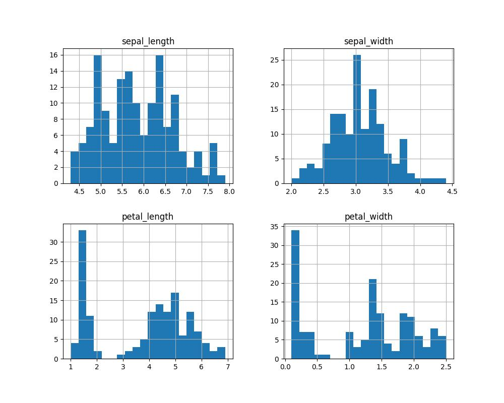
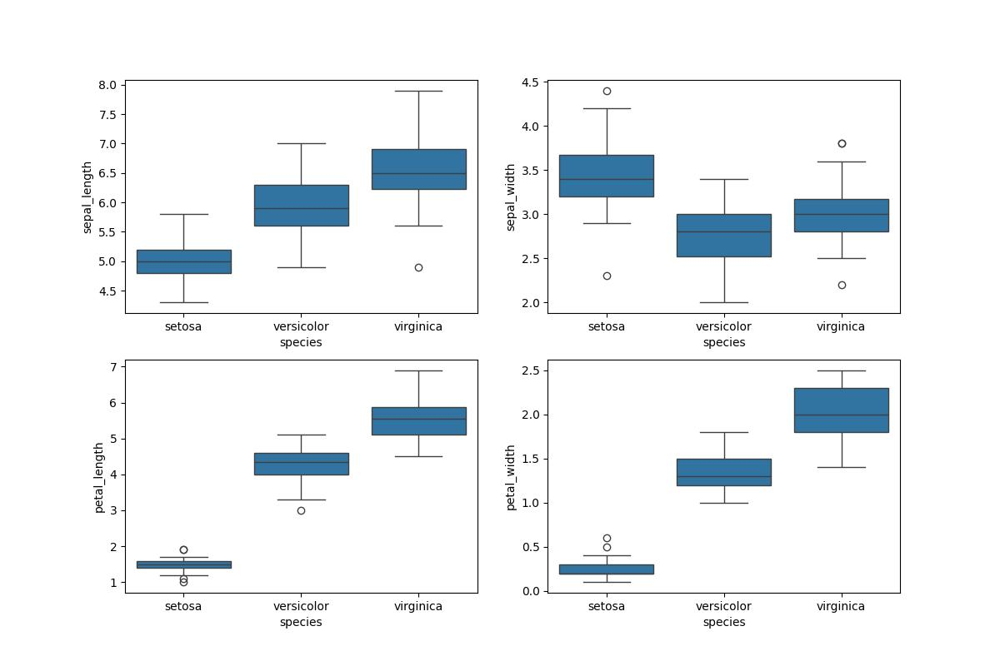
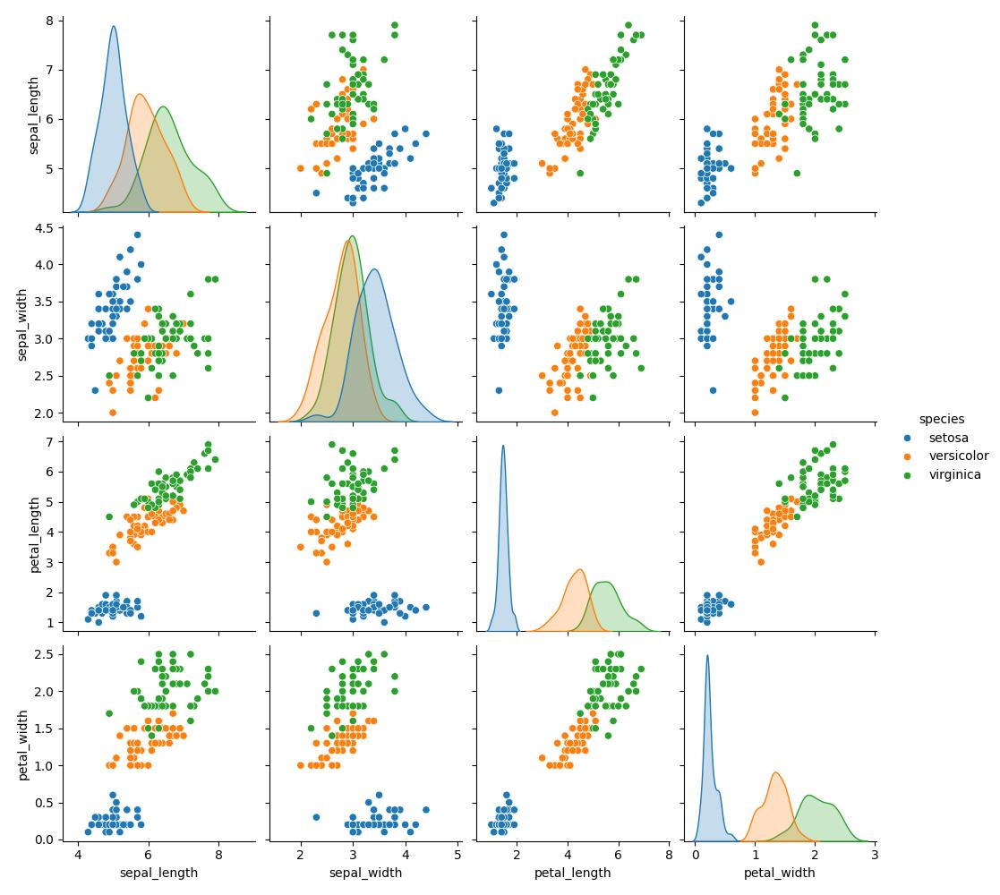
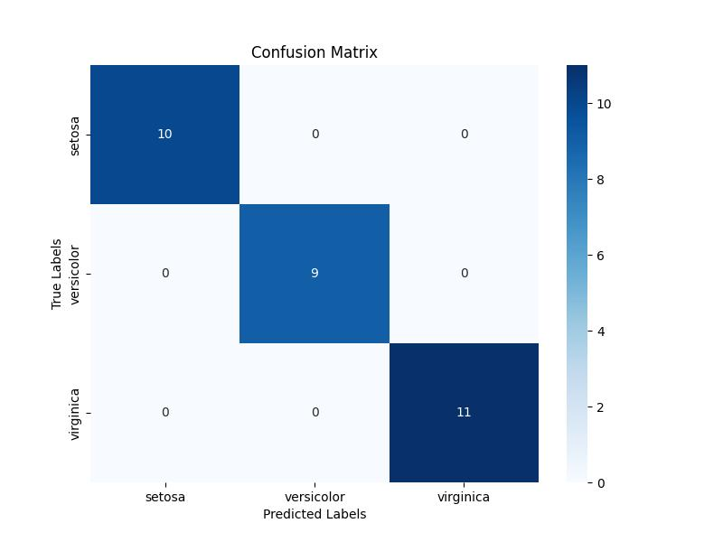
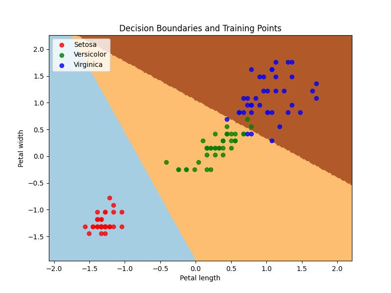

# Blog Post: Analyzing the Iris Dataset with Logistic Regression
*Note: this blog post was generated almost entirely by AI*
## Introduction
The Iris dataset is one of the most popular datasets among data science enthusiasts and beginners alike. Consisting of 150 samples from three different species of Iris (Iris Setosa, Iris Versicolor, and Iris Virginica), the dataset contains measurements of sepals and petals that we will explore and model to predict species classification based on physical attributes.

## Exploratory Data Analysis (EDA)
### **Understanding the Data**
The initial step in any data science project is to perform exploratory data analysis (EDA). For the Iris dataset, this involves summarizing statistics and visualizing data distributions:

- **Summary Statistics**: Provides insights into the mean, median, and standard deviation of petal and sepal dimensions across different species.
- **Visual Analysis**: Histograms and scatter plots reveal the distribution of data and the relationship between features.

Histograms showed the petal lengths and widths are particularly distinct among the species, which suggests good classification potential using these features.

### **Visualizations**

*Histogram showing the distribution of features in the Iris dataset.*

*Box Plots showing the variation of features in the Iris dataset.*

*Pair Plots showing the relative comparison of features in the Iris dataset.*

## Logistic Regression Model
### **Model Building**
To classify the Iris species based on the measurements, a logistic regression model was developed. This model type was chosen for its efficiency and interpretability in binary and multi-class classifications.

### **Training the Model**
The dataset was split into an 80/20 training-test ratio. The logistic regression model was trained on the standardized features for better accuracy and tested to evaluate its performance.

### **Model Accuracy**
The logistic regression model achieved a 100% accuracy rate on the test set:

*Confusion Matrix of the logistic regression model. Accuracy: 1.0*

This result indicates perfect classification of all test samples.

## Decision Boundary Visualization
Visualizing decision boundaries provides insight into how the logistic regression model interprets the data.

*Decision boundaries showing how the logistic regression model classifies the Iris species based on petal length and width.*

The plot shows clear separation between species, aligning with the high accuracy observed in model evaluation.

## Conclusion
This analysis demonstrates the capability of logistic regression for species classification in the Iris dataset, highlighting the importance of feature selection and model evaluation in machine learning workflows. Future work could explore other models like support vector machines or neural networks for comparison.

**Keywords**: Iris dataset, exploratory data analysis, logistic regression model, decision boundaries, data science, species classification.